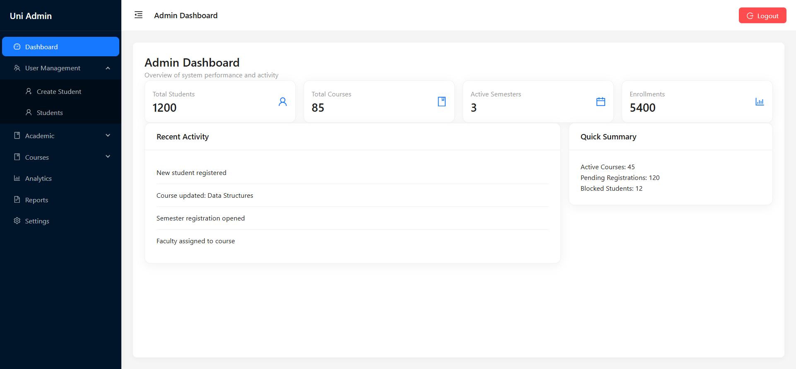
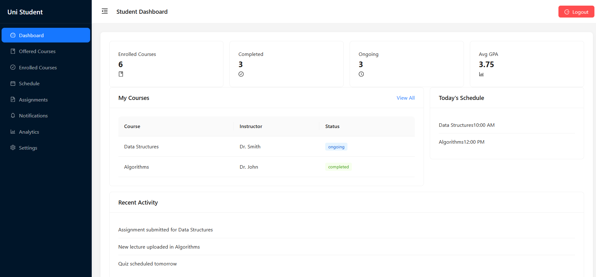
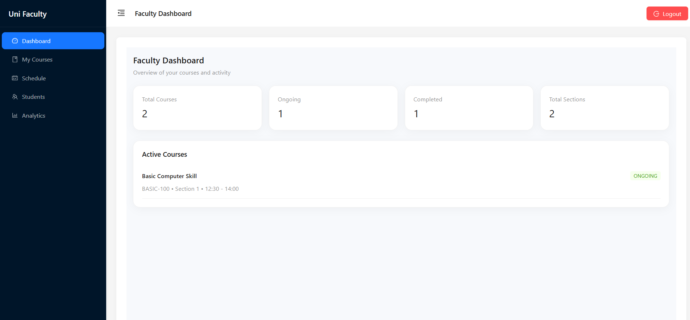

# 🎓 University Administration System (Frontend)

A **scalable, production-grade SaaS dashboard** that simulates a real-world university management system with **role-based access control, dynamic routing, and maintainable architecture**.

🚀 Built to demonstrate how **modern frontend systems are designed for scalability, flexibility, and long-term maintainability** — not just UI.

---

## 🌐 Live Demo

👉 https://university-administration-system-fr.vercel.app
💡 Try logging in with different roles using the demo credentials below

---

## 📸 Screenshots

### 🛠️ Admin Dashboard

Manage students, courses, and academic structure from a centralized interface.


### 🎓 Student Dashboard

Personalized view with course access and role-based navigation.


### 👨‍🏫 Faculty Dashboard

Faculty-specific tools for course and academic management.


---

## ⚡ Key Highlights

- 🔐 **Multi-role system** (Admin, Student, Faculty, Super Admin)
- 🧭 **Dynamic route & sidebar generation** from a single config
- 🧩 **Feature-based modular architecture** for scalability
- ⚡ **RTK Query API layer** with caching & invalidation
- 🧱 **Clean layout system** based on user roles
- ♻️ **Reusable and maintainable code structure**

---

## 🧠 Architecture Deep Dive

This project focuses on solving **real-world frontend architecture challenges**:

### 🔑 Role-Based Access Control

- Each route is mapped with **role metadata**
- Unauthorized access is blocked at the routing level
- Layouts are dynamically selected based on user role

### 🧭 Config-Driven Routing System

- Routes and sidebar are generated from a **central configuration**
- Single source of truth → easier scaling & maintenance
- Adding a new role or feature requires minimal changes

### ⚡ API Layer (RTK Query)

- Centralized API handling using **Redux Toolkit Query**
- Built-in caching and automatic data invalidation
- Reduces unnecessary network requests

### 🧩 Feature-Based Structure

- Code organized by **features/modules**, not by type
- Improves team scalability and long-term maintainability

---

## 🧠 Engineering Decisions

Some key decisions made while building this system:

- Chose **feature-based architecture** over type-based structure to improve scalability
- Used **RTK Query** instead of traditional Redux async logic to simplify API handling
- Designed **config-driven routing** to eliminate duplication between routes and sidebar
- Implemented **role-based layout switching** for cleaner separation of concerns

💡 These decisions reflect how real-world frontend systems evolve and scale over time.

---

## 💼 Business Value

This architecture is designed to solve real problems:

- 📈 Easily scales to support **multiple user roles and large datasets**
- ⚙️ Reduces development time for adding new features
- 🧠 Makes the system **maintainable for teams**
- 🔄 Enables faster iteration in real SaaS environments

💡 This is not just a dashboard — it’s a **foundation for scalable products**

---

## 🧠 Core Features

### 🔐 Authentication & Authorization

- JWT-based authentication
- Role-based access control (RBAC)
- Protected routes with dynamic validation
- Persistent login using Redux Persist

---

### 📊 Admin Dashboard

- Student Management
- Course Management
- Faculty & Department Management
- Semester Registration
- Offered Course System

---

### 🎓 Student Panel

- Personalized dashboard
- Course access system
- Role-based navigation experience

---

### 🎨 UI/UX

- Clean, production-level SaaS design
- Built with Ant Design system
- Fully responsive layout
- Consistent user experience across roles

---

## 🛠️ Tech Stack

- ⚛️ React + TypeScript
- 🧠 Redux Toolkit + RTK Query
- 🎨 Ant Design
- 🧭 React Router v6
- 📦 pnpm
- 🔐 JWT Authentication

---

## ⚡ Getting Started

```bash
git clone https://github.com/moshiur111/university-administration-system-frontend.git
cd university-administration-system-frontend
pnpm install
pnpm dev
```

---

## 📁 Project Structure

```
src/
├── modules/              # Feature-based modules
│   ├── student/
│   ├── course/
│   ├── offeredCourse/
│   └── ...
│
├── layout/               # Role-based layouts
├── routes/               # Dynamic route configuration
├── redux/                # Global state management
├── pages/                # Shared/global pages
├── utils/                # Route & sidebar generators
```

---

## 🚀 Future Improvements

- 🔔 Notification system
- 🌐 Multi-tenant architecture
- 📊 Advanced analytics dashboard
- 📁 File upload system
- 🌙 Dark mode support

---

## 🔐 Demo Credentials

```
Admin:
ID: A-0001
Password: admin123

Faculty:
ID: F-0001
Password: faculty123

Student:
ID: 2025020001
Password: student123
```

---

## 👨‍💻 Author

**Muhammad Moshiur Rahman**

- GitHub: https://github.com/moshiur111
- LinkedIn: https://www.linkedin.com/in/moshiur111

---

## ⭐ Support

If you find this project useful, consider giving it a ⭐ on GitHub!
